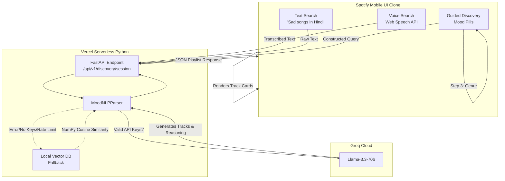

# Spotify AI Mood Discovery MVP

This project is a functional MVP for a highly contextual, AI-powered music discovery feature wrapped in a pixel-perfect clone of the Spotify mobile interface. 

It completely reimagines music search by letting users type natural language queries, use their voice, or follow a guided mood selection to get hyper-personalized playlists generated by the Groq LLM.

## ✨ Features
- **Spotify Native UI**: Built with pure HTML/CSS/JS to exactly mimic the Spotify mobile app.
- **Hands-Free Voice Search**: Speak your mood or context using the Web Speech API.
- **Groq LLM Integration**: Uses `llama-3.3-70b-versatile` to deeply understand context and return real song recommendations with explanations.
- **Guided Discovery**: Click a Mood Pill (e.g., "Relaxed") to trigger a multi-step interactive flow (Language -> Genre -> Style).
- **Vercel Serverless Ready**: Designed to deploy instantly on Vercel with a hybrid architecture (Static Frontend + Python Serverless API).
- **API Key Rotation & Fallback**: Automatically rotates between 3 Groq API keys, and gracefully falls back to a local vector database (`numpy`) if rate-limited or unauthenticated.

---

## 🏗 User Data Flow Architecture



---

## 🚀 Deployment (Vercel)

This project is fully configured for Vercel deployment.

1. **Push to GitHub**: Fork or push this repository to your GitHub account.
2. **Import to Vercel**: Create a new project in Vercel and import the repository.
3. **Set Environment Variables**: In your Vercel Project Settings, add your Groq API keys:
   - `GROQ_API_KEY_1`
   - `GROQ_API_KEY_2`
   - `GROQ_API_KEY_3`
4. **Deploy**: Vercel will automatically read `vercel.json`, install dependencies from `requirements.txt`, and map the `/api` routes to your Python backend.

---

## 💻 Local Development

If you want to run this project locally on your machine:

1. **Install Python Dependencies**:
   ```bash
   pip install -r requirements.txt
   ```

2. **Add Environment Variables**:
   Create a `.env` file in the root directory and add your Groq API keys:
   ```env
   GROQ_API_KEY_1=gsk_your_key_here
   GROQ_API_KEY_2=gsk_your_key_here
   GROQ_API_KEY_3=gsk_your_key_here
   ```

3. **Run the FastAPI Server**:
   ```bash
   uvicorn phase3.server:app --port 8005 --reload
   ```

4. **View the App**:
   Open your browser and navigate to `http://127.0.0.1:8005`.
