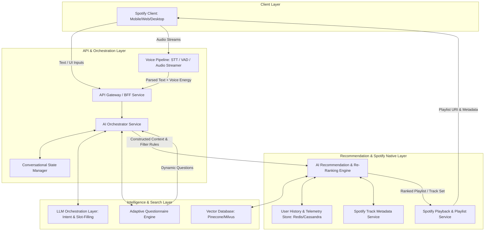
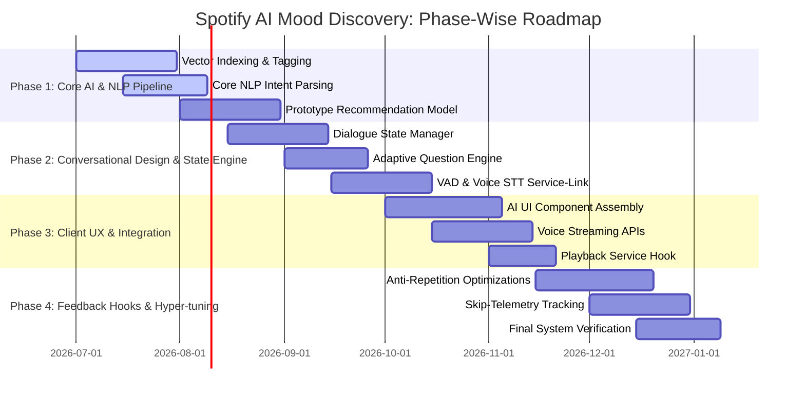
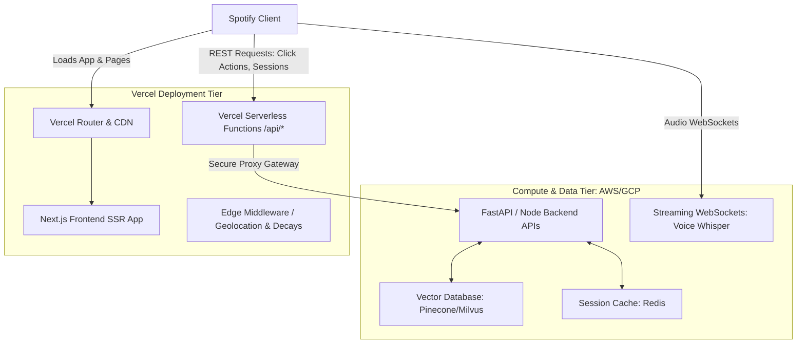

# Spotify AI Mood Discovery: Phase-Wise System Architecture Design

This document outlines the system architecture and data pipelines for the **Spotify AI Mood Discovery** feature. The system is designed to increase meaningful music discovery, reduce repetitive listening patterns, and provide highly contextual, mood-aware recommendations via text and hands-free voice search.

---

## 1. High-Level Architecture Overview

The system uses a decoupled approach, separating conversational interface management from the underlying music candidate fetching and re-ranking pipeline. Both voice and text modes feed into the same backend pipeline.

To visualize how these services interact, here is the core system architecture diagram:



---

## 2. Core Operational Flow & Wireframe Mapping

Based on the interactive wireframe flow, there are three primary interaction paths: **Dynamic AI Mood Search**, **Guided AI Discovery**, and **Hands-Free Voice Search**.

### A. Guided AI Discovery Flow (State-Based)

The Guided path collects context through interactive steps. The diagram below illustrates the adaptive state machine:

```mermaid
stateDiagram-v2
    [*] --> MoodSelection : User clicks "AI Discovery" on Home Screen
    
    state MoodSelection {
        [*] --> DisplayMoodButtons
        DisplayMoodButtons --> UserSelectsMood : Taps Happy/Sad/Energetic/Calm/Relaxed
    }
    
    MoodSelection --> ActivitySelection : Transition
    
    state ActivitySelection {
        [*] --> DisplayActivityButtons
        DisplayActivityButtons --> UserSelectsActivity : Taps Workout/Study/Driving/Cooking/Relaxing
    }
    
    ActivitySelection --> LanguageSelection : Transition
    
    state LanguageSelection {
        [*] --> DisplayLanguageButtons
        DisplayLanguageButtons --> UserSelectsLanguage : Taps English/Hindi/Spanish/Other
    }
    
    LanguageSelection --> GenreSelection : Transition
    
    state GenreSelection {
        [*] --> DisplayGenreButtons
        DisplayGenreButtons --> UserSelectsGenre : Taps Rock/Pop/Hip-Hop/Indie/Classical
    }
    
    GenreSelection --> PreferenceSelection : Transition
    
    state PreferenceSelection {
        [*] --> DisplayPreferenceButtons
        DisplayPreferenceButtons --> UserSelectsPreference : Taps Fresh Vibes/Co-vibe/Discovery
    }
    
    PreferenceSelection --> RecommendationEngine : Package Session State Document
    
    state RecommendationEngine {
        [*] --> VectorSearch
        VectorSearch --> ApplyAntiRepetitionFilter
        ApplyAntiRepetitionFilter --> GeneratePlaylist
    }
    
    RecommendationEngine --> [*] : Playback & UI Render
```



---

## 3. Subsystem Breakdown

### 1. Front-End Integration
*   **AI Search Bar**: Integrated globally within the Search screen, underneath the library shortcuts, featuring a dynamic microphone button.
*   **Audio Streaming Hook (Client-side)**: Captures voice input in chunks (Opus format via WebSockets) to allow streaming Speech-to-Text inference to begin instantly.
*   **Stateful UI Renderer**: Dynamically constructs bubble-based interactive selection chips depending on backend directives (enabling runtime layout adjustment).

### 2. Voice Pipeline Component
*   **Voice Activity Detector (VAD)**: Runs client-side (or lightweight server-side proxy) to detect pauses, allowing the conversation to continue hands-free.
*   **Streaming Speech-to-Text (STT)**: Employs Whisper models to transcribe raw user voice feeds to text, adding confidence values and emotional tone metrics (prosody/tempo) to enhance mood classification.

### 3. AI Conversational & Orchestration Service
*   **Dialogue Session Manager (Redis-backed)**: Maintains dialogue histories. Generates a "Dialogue Session State" containing slots.
*   **Natural Language Parser (NLP)**: Maps unstructured phrases (e.g. *"I'm feeling low on this rainy day..."*) to extraction values:
    *   **Intent**: `PLAY_MUSIC`, `DISCOVER_ARTISTS`, `CREATE_MIX`
    *   **Context Slots**: `Mood: sad/melancholy`, `Weather: rainy`, `Energy-Target: uplifting`
*   **Slot-Filling & Follow-up Controller**: Evaluates slot completeness. If parameters (e.g., mood, activity, or preferred language) are missing, it triggers a dialogue state that asks 2–4 targeted questions.

### 4. Recommendation & Anti-Repetition Engine
*   **Acoustic & Semantic Embeddings Layer**: Matches query embeddings with a vector index mapping Spotify audio parameters (Valence, Arousal, Danceability, Tempo) alongside lyrics themes.
*   **Anti-Repetition Filtering System**: The core mechanism designed to break repetitive listening patterns.

---

## 4. Advanced Anti-Repetition & Meaningful Discovery Strategies

To counteract repetitive loops (where standard collaborative filtering locks users into past habits), the system injects diversity constraints and feedback penalty functions.

### The Recommendation Scoring Function

Let the recommendation score $S(t, u, c)$ for a track $t$, user $u$, and context $c$ be computed as:

$$S(t, u, c) = w_{1} \cdot S_{semantic}(t, c) + w_{2} \cdot S_{user}(t, u) - P_{repetition}(t, u) + B_{discovery}(t, u)$$

Where:
*   $S_{semantic}(t, c)$: Visual/acoustic match between the track's features (tempo, valence, mood embeddings) and the user's current situation.
*   $S_{user}(t, u)$: Standard collaborative filtering rating (capturing base compatibility).
*   $P_{repetition}(t, u)$: **Repetition Penalty Score** (detailed below).
*   $B_{discovery}(t, u)$: **Discovery Boost Factor** supporting non-customary music categories.

### Repetition Penalty Function

The penalty function reduces the probability of recommending recently or frequently played tracks:

$$P_{repetition}(t, u) = \lambda_{1} \cdot e^{-\alpha \cdot \Delta T(t)} + \lambda_{2} \cdot \left( \frac{Count_{30}(t)}{MaxCount_{30}} \right)$$

*   $\Delta T(t)$: Time elapsed (in days) since track $t$ was last played by user $u$.
*   $Count_{30}(t)$: Number of times track $t$ has been played in the last 30 days.
*   $\lambda_{1}, \lambda_{2}, \alpha$: Tuneable thresholds determining penalty decay speeds.

### Discovery Boost ($B_{discovery}$)

To resurface underground music and new genres, we apply a selection bias to tracks meeting these criteria:
*   **Hidden Gems**: Artists with low global popularity ratings ($< 40/100$) but high listener retention coefficients.
*   **Emerging Artists**: Released within the last 180 days with a high growth trajectory metric.

---

## 5. DB Schemas & API Contracts

Below are schema suggestions and JSON specifications designed to support the system.

### A. Redis Structure: Conversational Dialogue Cache
Stores real-time dialogue metadata to drive the Guided multi-question sequence.

```json
{
  "session_id": "sess_89a022f4b23c10",
  "user_id": "usr_spotify_98374",
  "phase": "guided",
  "current_turn": 3,
  "slots": {
    "mood": "Calm",
    "activity": "Studying",
    "preferred_language": "English",
    "genre": null,
    "discovery_preference": null
  },
  "dialogue_history": [
    {"speaker": "system", "text": "What is your mood now?"},
    {"speaker": "user", "text": "Calm"},
    {"speaker": "system", "text": "What are you doing?"},
    {"speaker": "user", "text": "Studying"}
  ],
  "engine_parameters": {
    "novelty_weight": 0.85,
    "gem_only_bias": false
  }
}
```

### B. Core Recommendation Service REST API

#### Endpoint: `POST /api/v1/discovery/recommend`
Generates personalized playlists based on finalized dialogue session payloads.

**Request Header:** `Authorization: Bearer <JWT_Token>`

**Request Body:**
```json
{
  "session_id": "sess_89a022f4b23c10",
  "context": {
    "mood": "Calm",
    "activity": "Studying",
    "language": "English",
    "genre": "Lo-Fi / Indie",
    "mode": "Mostly New Discoveries"
  },
  "constraints": {
    "limit": 20,
    "max_artist_skips": 1,
    "avoid_tracks_played_within_days": 14,
    "min_novelty_score": 0.70
  }
}
```

**Response Body:**
```json
{
  "playlist_id": "ai_discover_playlist_88f91a2bc",
  "name": "Studying Calmly - AI Custom Mix",
  "query_mood_context": "Calm & Studying",
  "tracks": [
    {
      "track_id": "3n2p2B8r7x042...",
      "title": "Rivers Turn",
      "artist": {
        "artist_id": "7L3b...",
        "name": "Paper Bark",
        "is_hidden_gem": true
      },
      "album": "Leaf Fall Ep",
      "novelty_score": 0.92,
      "audio_url": "https://p.scdn.co/mp3-preview/..."
    }
  ]
}
```

---

## 6. Implementation Stages (Phase-wise Architecture Roadmap)



### Phase 1: Semantic Foundation & Vector Matching (Research & Core Data Architecture)
*   **Goal**: Establish vector representation capabilities for tracks based on lyrics sentiment, acoustic properties (Valence, Arousal, Energy), and user mood contexts.
*   **Deliverables**:
    1. A Vector database setup containing track embeddings.
    2. A NLP query parser mapping user search phrases to a structured search query.
    3. A basic multi-criteria candidate generator using cosine similarity scores.

### Phase 2: Dialogue State Machine & Context Injection
*   **Goal**: Enable dynamic, stateful conversation flow containing 2-4 slot-filling rounds for context refinement.
*   **Deliverables**:
    1. A stateless Session State Manager caching conversational history inside Redis.
    2. The **Adaptive Questioning Module** which computes missing information entropy to choose the next question.
    3. STT / VAD linking proxies handling continuous voice-to-text transitions.

### Phase 3: Spotify Client & Voice Integration (Dedicated Frontend Focus)
*   **Goal**: Hook up the client-side screens (following the user-directed wireframes) to input audio streams and render the matching playlists.
*   **Deliverables**:
    1. High-fidelity UI layouts in the mobile search section.
    2. Dynamic selection bubbles responding to state responses.
    3. Hands-free voice components featuring local audio capturing.

### Phase 4: Telemetry Feedback Loop & Anti-Repetitive Tuning (Reinforcement Learning)
*   **Goal**: Train system algorithms to avoid playing repetitive tracks, utilizing direct feedback signals from listener skips to refine the penalization equations.
*   **Deliverables**:
    1. The telemetry logging agent tracking explicit actions (skips before 30 sec, completions, custom saves).
    2. Adaptive adjustment of decay constants ($\alpha$) based on user-wide repetition metrics.
    3. Reinforcement learning feedback training algorithms to continuously improve long-tail discovery.

---

## 7. Dedicated Frontend UI/UX Architecture Phase

Developing a premium, gesture-rich, and smooth frontend interface requires structured stages:

```mermaid
graph LR
    subgraph STAGE 1: UI Shell & Theme
        TS1[Define HSL Tokens] --> TS2[AI Search Bar Component]
        TS2 --> TS3[Floating Mic Icon with Wave Animation]
    end

    subgraph STAGE 2: Stateful Guided Dialogue
        GD1[Dynamic Router & Viewport Manager] --> GD2[Slot Selection Chip Matrix]
        GD2 --> GD3[Bubble Animation Engine - Framer Motion]
    end

    subgraph STAGE 3: Audio Interface Hook
        AI1[Web Audio API Recorder] --> AI2[Local Voice Activity Detector VAD]
        AI2 --> AI3[WebSocket Streaming Handler]
    end

    subgraph STAGE 4: Player Engine Integration
        PE1[Spotify Web Playback SDK Wrapper] --> PE2[Real-time Feedback Hooks: Skip / Save]
    end

    STAGE 1 --> STAGE 2
    STAGE 2 --> STAGE 3
    STAGE 3 --> STAGE 4
```

### Stage 1: Design Tokens & Layout Integration
*   **Glassmorphism Theme**: Define backdrop filters, semantic offsets, and custom gradient tokens matching the premium search wireframes.
*   **AI Search Bar**: A capsule-shaped entry point carrying active glowing border animations representing the AI listener presence.
*   **Microphone Component**: Implemented with customizable micro-interactions, scaling and changing color depending on vocal frequency input.

### Stage 2: Dynamic Question Matrix Component (`<SlotChipMatrix />`)
*   Instead of a static sequence template, properties map to bubble chips.
*   **Interactive Transitions**: Leverages CSS transitions or Framer Motion to slide out previous selections and glide in next-step chips.

### Stage 3: Audio Media Pipelines
*   Uses HTML5 Media Stream APIs to register microphone interfaces.
*   **PCM Client-Side Worker**: Standardizes audio sampling rates to 16kHz before packing blocks and piping them to the websocket backend.

---

## 8. Vercel Deployment & API Implementation Architecture

Deploying this multi-faceted system requires dividing the deployment footprint across two layers: **Vercel** (for high-speed SSR UI rendering, Edge caching, and light slot processing) and a **Dedicated Compute Tier** (for heavy tasks like live NLP parsing, Whisper transcription, and Vector database search).



### A. Implementing REST/Serverless APIs on Vercel
*   **Next.js API Routing**: All user-session actions, selection cache setups, and initial query configurations are processed in Serverless APIs (e.g., inside `/pages/api/discovery/recommend.ts` or `/app/api/discovery/recommend/route.ts`).
*   **API Edge Routes**: Use Next.js Edge Runtime for `/api/v1/sessions` to maintain low latency. Edge functions perform fast JWT token validations, parse metadata headers, and cache responses at CDN edge nodes.

### B. Why We Split Heavy Workloads from Vercel
While Vercel is ideal for UI delivery and lightweight REST APIs, certain background features require a dedicated server tier:
1.  **WebSocket Persistence**: Hands-free voice tracking streams continuous voice packages. Vercel Serverless runs on an ephemeral basis and does not support persistent bidirectional WebSockets.
2.  **Model Calculation & Latency**: Running NLP tokenizers or processing large vector search embeddings locally exceeds serverless compute limits (timeouts and memory resource allocations).

### C. Implementation Directory Outline for APIs

```
├── spotify-ai-mood-app/
│   ├── app/                      # Next.js Frontend Pages & Router (Vercel Host)
│   │   ├── api/                  # Vercel Serverless API Routes
│   │   │   ├── session/          # Orchestrates dialogue slots
│   │   │   │   └── route.ts
│   │   │   └── recommend/        # Client gateway proxying recommendation backend
│   │   │       └── route.ts
│   └── backend/                  # Dedicated Backend Services (FastAPI/Node on AWS)
│       ├── voice_service/        # WebSocket interface for Audio Streaming + Whisper STT
│       ├── recommender/          # Recommendation Engine, Vector Search & Anti-Repetition math
│       └── main.py
```
